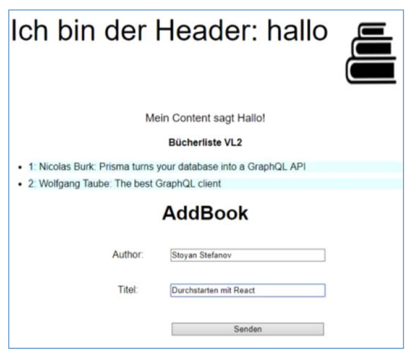

Die Zweite Aufgabe besteht aus einer Liste von Objekten welche interaktiv verlängert werden kann und dauerhaft gesichert wird. 
Hier geht es zum
[Aufgabenblatt](https://www.dm.hs-furtwangen.de/data/files/download_temp/04a0df98fa4590644cede6a9eacc543c/JSF_A2.pdf).  
Hier geht es <strong>vielleicht</strong> zum [Github](https://no) der Aufgabe.

>Erstellen Sie in mehreren Schritten eine React-Anwendung, die eine Liste von Objekten anzeigt und verwaltet (z.B. Links mit URL und einer kurzen Beschreibung). In der Endform sollen diese Objekte angezeigt, neu erstellt, geändert und gelöscht werden können. Eine permanente Datenhaltung entweder lokal oder auf einem entfernten Server ist noch nicht erforderlich – dies wird dann der nächste große Schritt.
Zentrale Themen bei dieser Aufgabe sind: Arbeiten mit Datenstrukturen, props & state, Umgang mit Formularen, Unidirectional Databinding, Routing. In der Vorlesung werde ich die entsprechenden Themen behandeln – wer sich schon besser mit React auskennt, kann gerne direkt die endgültige Version erstellen und mir im Praktikum zeigen.

Die Aufgabe liegt [hier](https://webuser.hs-furtwangen.de/~allmendi/site_aufgabe_2/) und ist unten eingebettet.

<iframe height="260" width="280" src="https://webuser.hs-furtwangen.de/~allmendi/site_aufgabe_2/">
</iframe>

